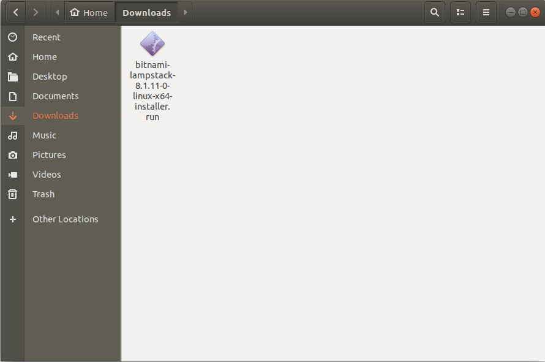
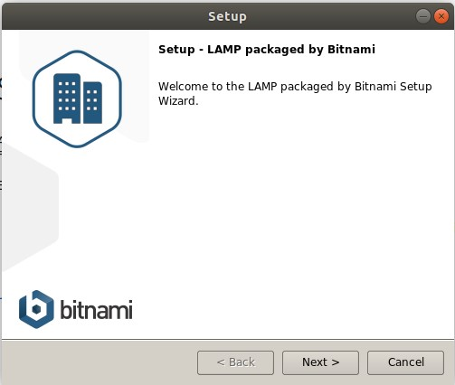
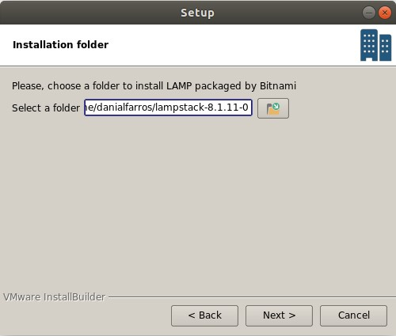
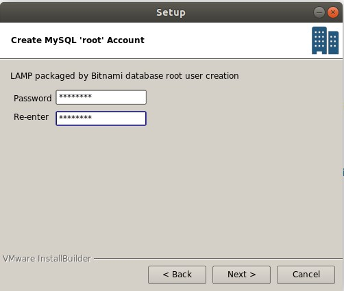
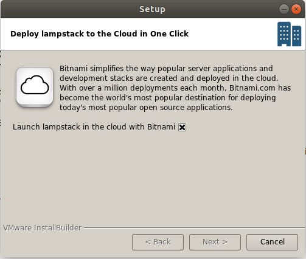
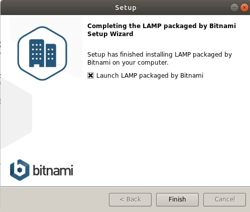
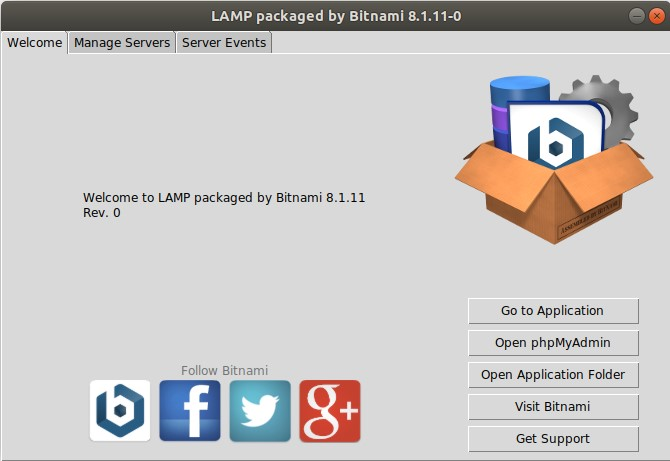
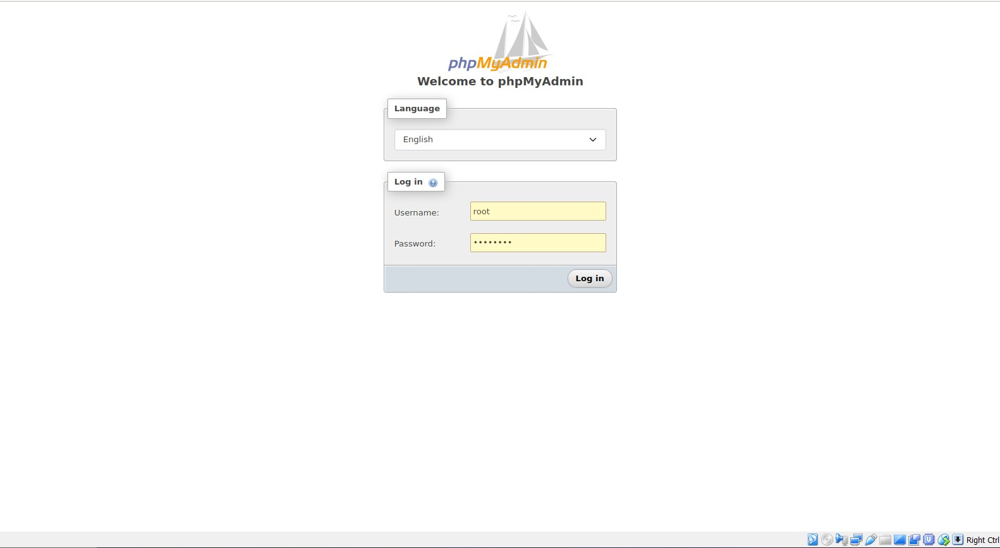

## APA ITU LAMP

Lampp merupakan singkatan dari Linux, Apache, MySQL, perl/php/python. Merupakan sebuah paket perangkat lunak bebas yang digunakan untuk menjalankan sebuah aplikasi secaralengkap

Komponen-komponen dari LAMP:
- **Linux** Linux sendiri berperan sebagai sistem informasi yang berbasi Unix yang digunakan oleh pengguna secara gratis. Linux sendiri merupakan perwakilan dari sistem lainnya seperti FreeBSD, NetBSD, OpenBSD dan Darwin/Mac OS X.
- **Apache** Komponen ke dua ini adalah web browser open source yang artinya dapat digunakan secara gratis. Fungsi utama Apache ini dapat menghasilkan halam web yang telah programmer kerjakan  menggunakan bahasa pemrogramman PHP.
- **MySQL** Terdengan cukup familiar memang, komponen ini merupakan sistem database yang sering digunakan bersama PHP.
- **Perl atau PHP atau Pyton**  PHP adalah sebuah bahasa pemrogramman untuk memnbuat suatu web. Selain Windows, PHP juga dapat digunakan pada sistem operasi Linux dan lainnya.

Beberapa perangkat lunak yang menggunakan konfigurasi LAMP antara lain MediaWiki dan Bugzilla.

## Kelebihan menggunakan LAMPP
- memiliki sistem database yang keamanannya terjamin
- proses development yang lebih cepat
- dapat dikustomisasi sesuai kebutuhan developer
- kode di dalamnya dapat bekerja pada berbagai OS, seperti Windows, Linux, Android, dan iOS

## Cara instalasi

 1. file instalasi dapat di download [di sini](https://bitnami.com/stack/lamp/installer)
 2. langsung saja di install tadi downloadnya 
   
   

 3. langsung di klik next aja
   
   
   
   

 4. ketikkan password yang mau dugunakan untuk akun SQL  
     
   
   
   
   

 5. Instalasi selesai LAMMP dapat di gunakan
   
   

Gunakan username `root` dan password yang di masukkan pada saat instalasi untuk menggunakan phpMyAdmin

